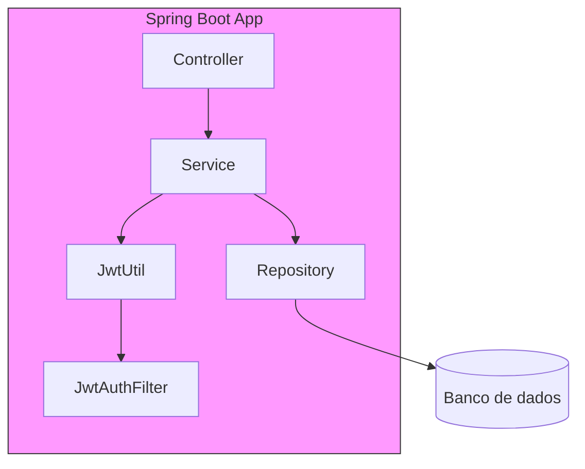
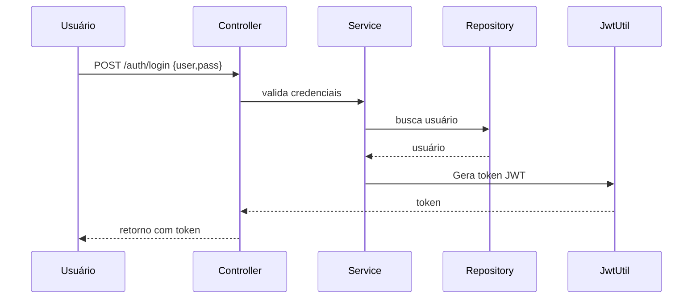

# Spring Boot JWT Template

Template de projeto Spring Boot com autenticação JWT, tratamento global de exceções e estrutura pronta para iniciar novos projetos de backend em Java.

> 🚀 **Atualizado para Java 21 e Spring Boot 4**


## ✨ Objetivo
Este projeto serve de base para acelerar o desenvolvimento de novos sistemas utilizando:

- **Spring Boot** (4.x)
- **Java 21** (LTS)
- **Autenticação JWT** (JSON Web Token)
- Cadastro e login de usuários
- Criptografia de senha (BCrypt)
- Tratamento global de exceções
- Integração imediata com bancos PostgreSQL e H2

Você pode clonar e customizar este projeto conforme a demanda dos seus próximos trabalhos!

## 🚀 Tecnologias Utilizadas
- **Java 21** (upgrade realizado)
- **Spring Boot 4**
  - Spring Web MVC
  - Spring Security
  - Spring Data JPA
  - Thymeleaf
- JWT (io.jsonwebtoken)
- Banco PostgreSQL (padrão, configurável via `application.properties`)
- Banco H2 para testes locais
- Lombok para reduzir boilerplate
## 📦 Estrutura do Projeto

Cada pacote tem responsabilidade clara, seguindo as convenções do Spring:

- `controller` – Endpoints REST (exemplo: autenticação / registro)
- `model` – Entidades JPA que representam tabelas do banco
- `repository` – Interfaces de acesso a dados (Spring Data JPA)
- `service` – Regras de negócio (cadastro, tradução DTO↔entity, etc.)
- `security` – Filtros/Utils JWT e configuração de segurança
- `exception` – Exceções customizadas e manipulador global
- `DTO` – Objetos de transferência de dados para API

---

### 🧠 Diagrama de arquitetura



### 🔐 Fluxo de autenticação



## ⚙️ Como rodar o projeto

### Pré-requisitos
- **Java 21** ou superior
- Maven 3.8+
- PostgreSQL (opcional, para rodar com banco real)

---

### Rodando localmente
1. **Clone este repositório**
   ```bash
   git clone <url-do-repo>
   cd spring-boot-jwt-template
   ```
2. **Configure o banco de dados**
   - O projeto já vem configurado para PostgreSQL por padrão.
   - Edite `src/main/resources/application.properties` para ajustar usuário, senha ou banco.
   - Para testar sem banco externo, configure o H2 no `application.properties`.
3. **Compile e execute**
   ```bash
   mvn clean spring-boot:run
   ```
4. Acesse o projeto: `http://localhost:8080`

---

### 👀 Documentação Swagger (OpenAPI)
Este template não inclui o Swagger por padrão, mas é fácil adicionar:

1. **Adicionar dependência** (exemplo usando Springdoc OpenAPI 2):
   ```xml
   <dependency>
       <groupId>org.springdoc</groupId>
       <artifactId>springdoc-openapi-starter-webmvc-ui</artifactId>
       <version>2.1.0</version>
   </dependency>
   ```
2. **Configurar base path (opcional)**:
   ```java
   @Configuration
   public class OpenApiConfig {
       @Bean
       public OpenAPI customOpenAPI() {
           return new OpenAPI().info(new Info().title("API JWT").version("v1"));
       }
   }
   ```
3. **Acessar** `http://localhost:8080/swagger-ui.html` ou `/swagger-ui/index.html` para visualizar e testar endpoints.

> 💡 O Swagger atualiza automaticamente quando você adiciona novos controladores.

### Rodando localmente
1. **Clone este repositório**
   ```bash
   git clone <url-do-repo>
   cd spring-boot-jwt-template
   ```
2. **Configure o banco de dados**
   - O projeto já vem configurado para PostgreSQL por padrão
   - Edite o arquivo `src/main/resources/application.properties` se quiser mudar usuário, senha ou banco
   - Para testar sem banco externo, configure o H2 no properties

3. **Rode o projeto**
   ```bash
   mvn spring-boot:run
   ```

4. Acesse o projeto: `http://localhost:8080`

## 🔐 Rotas de exemplo

- `POST /auth/register` — Cadastra usuário (`username`, `password`)
- `POST /auth/login` — Autentica usuário e retorna JWT

## 🛡️ Segurança
- As senhas são guardadas de forma criptografada (BCrypt)
- O token JWT expira após 24h
- Inclui endpoints protegidos e abertos para facilitar customização

## ⚠️ Observações
- Este projeto **não possui frontend** pronto
- Ideal para novos projetos backend RESTful

---

Se for útil para você, faça um fork ou clone para servir de base para seus próprios sistemas!

---
Desenvolvido por Roberto Lara

